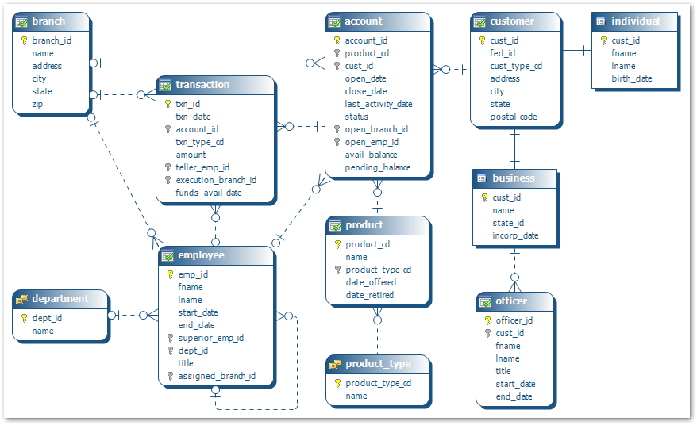
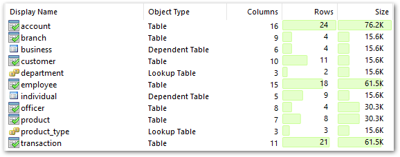

# Web Developer Practical Interview Brief

## Project Overview

You are tasked with building a simple CRUD (Create, Read, Update, Delete) application for a bank. You have the freedom to choose a framework for the front-end. Your back-end frameworks should utilise PHP i.e. laravel, symphony, codeigniter. So please use technologies you are comfortable with. The application should have the following features:

## Front-End Requirements

1. **Search View:** An initial page the bank teller could use to search for a customer/bank account.

2. **Create:** Implement a form to allow the teller to add transactions to a bank account

3. **Update:** Allow the teller to update the customers contact information.

4. **Responsive Design:** Ensure the application is responsive and works well on both desktop and mobile devices.

5. **⭐Bonus - Dashboard⭐:** Provide a basic dashboard for the teller that would show key information such as the number of customers or open bank accounts, the sum of funds deposited etc.

## Back-End Requirements

1. **Data Storage:** Implement a method to store, update and retrieve entries from the database.

2. **Secure:** Implement basic security features to prevent exploits such as SQL injection & CSRF attacks.

3. **⭐Bonus - Unit Test⭐:** Write unit tests for any CRUD operations.

## Submission Guidelines

- Please create a GitHub repository for this project.
- Include clear instructions on how to set up and run your application locally in the README.md file.
- Make regular commits to your repository to showcase your development process.

## Evaluation Criteria

Your submission will be evaluated based on the following criteria:

- Functionality: Does the application meet the specified requirements?
- Code Quality: Is the code well-organized, maintainable, and readable?
- Front-End Design: Is the user interface intuitive, responsive, and visually appealing?
- Back-End Logic: Is the back-end logic efficient and secure?
- Documentation: Are setup instructions and any necessary documentation provided?

## Additional Information

A sample database has been provided in the assets folder taken from [_Alan Beaulieu_ book Learning SQL, 2nd Edition](https://www.oreilly.com/library/view/learning-sql-2nd/9780596801847/)

If you have any questions or need clarification on any aspect of this project, please feel free to ask and if there is anything additional you would like to add to truly showcase your talents then we are welcome to seeing it.

Good luck, and we look forward to reviewing your submission!
